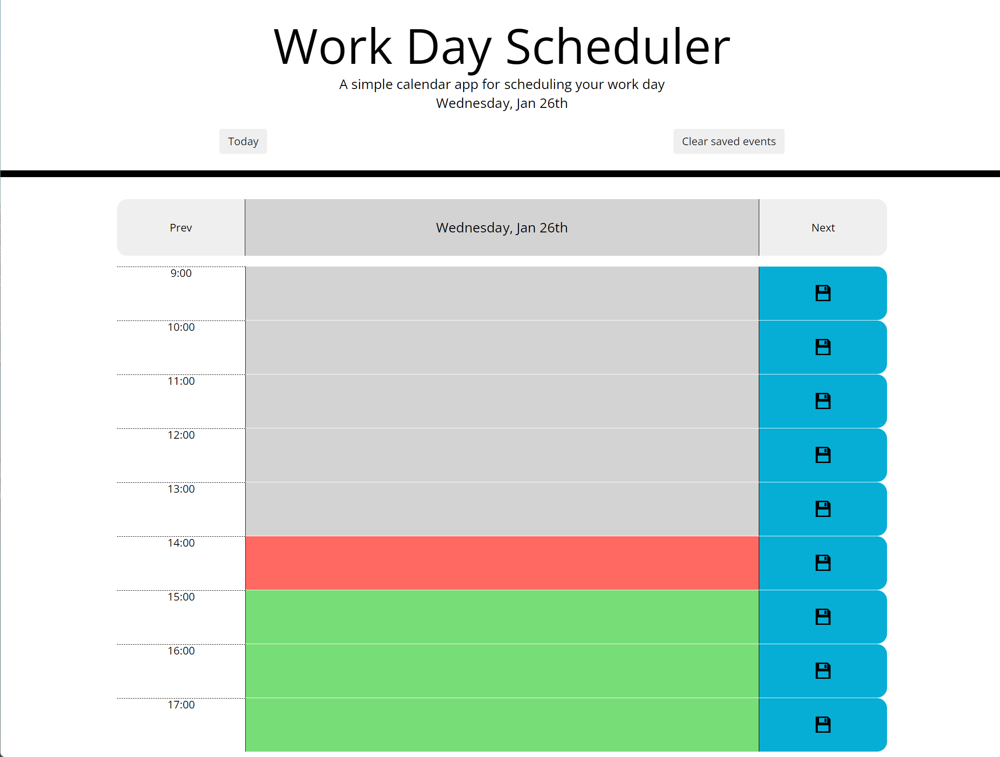

# Day planner

## Description

A day planner application that helps plan your schedule in one hour blocks. It started as just a planner for current day, but has been extended to allow moving back and forward. See historical events and plan tasks days ahead. The UI has buttons to navigate to previous or next day as well as a button to quickly come back to the current day. Events are saved to local storage and loaded when moving between days or refreshing the page. Current hour is highlighted as orange, the past hours are grey and the future hours are in green highlight. The save button at the end of the hour block saves only that row. 

The planner is built using HTML, CSS and JavaScript and uses Bootstrap, jQuery and moment.js.

## Screenshots
Following GIF shows a high level oveview of the features.

## Technologies
- HTML
- CSS
- Javascript
- Bootstrap
- jQuery
- moment.js

## Links
The GitHub pages hosted version of the day planner is [here](https://frye.github.io/day-planner/).
